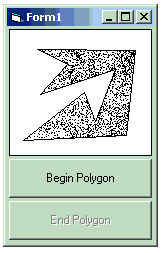



## Point in Polygon

### Description

Find a point in a polygon. Useful for some graphics applications
 
### More Info
 

             |
---                |---
**Submitted On**   |2006-03-10 00:28:26
**By**             |[Foundations Software](https://github.com/Planet-Source-Code/PSCIndex/blob/master/ByAuthor/foundations-software.md)
**Level**          |Beginner
**User Rating**    |5.0 (10 globes from 2 users)
**Compatibility**  |VB 6\.0
**Category**       |[Graphics](https://github.com/Planet-Source-Code/PSCIndex/blob/master/ByCategory/graphics__1-46.md)
**World**          |[Visual Basic](https://github.com/Planet-Source-Code/PSCIndex/blob/master/ByWorld/visual-basic.md)
**Archive File**   |[Point\_in\_P1979023102006\.zip](https://github.com/Planet-Source-Code/foundations-software-point-in-polygon__1-64595/archive/master.zip)

